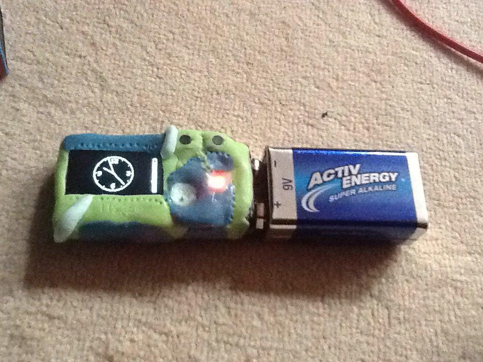
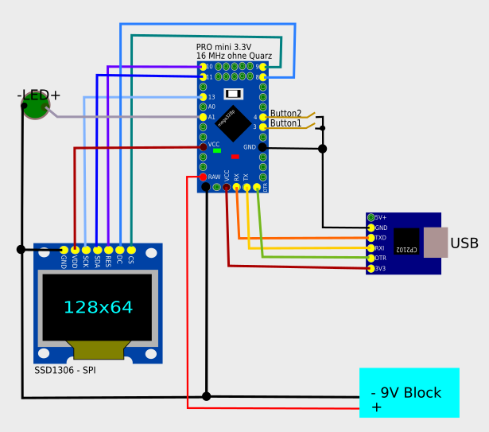

# WatchTerminal

uses SSD1306 128x64 with 

- mosi 11
- sclk 13
- dc 8
- cs 9
- reset 10

# Features

Es ist eine uhr mit zwei knöpfen, display, weisser LED, 9V Block kontakt und einem usb anschluss. Das letzte ist dafür da, um das Display als seriellen Terminal nutzen zu können. Sendet Text darüber, sieht man den statt der uhr. Sendet man ein \n schaltet es wieder die Uhr an und der Text geht weg. Es kann 168 zeichen darstellen. Mit den 2 knöpfen kann man die Uhrzeit einstellen ODER das Dinosaurier Spiel spielen. Verliert man darin ein Leben, geht kurz die LED an. Eine Baterie Anzeige ist auch immer zu sehn. aus geht das Ding nur, wenn man den Strom unterbricht. Vom 9V Block zieht das Ding 20 mA.

# Circuit

