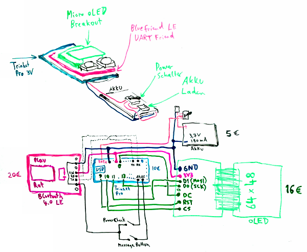
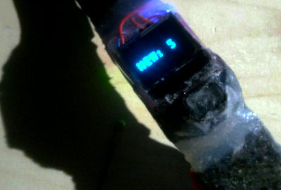
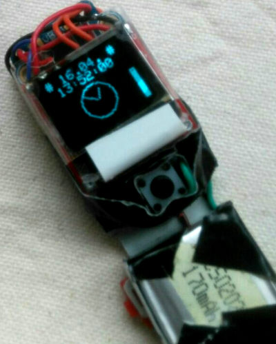

# Do It Yourself Smartwatch

This is a snapshot of the code, hosted by me: [Gogs](https://dummer.click:8080/unknown/)

## Was kann meine DIY-Smartwatch?

Sobald die App eine Verbindung zur Uhr aufgebaut hat (Smartwatch leuchtet dann blau), sendet die App (Auch wenn das Handydisplay ausgeschaltet ist) die Statusmeldungen an die Smartwatch.

 -  Umlaute und ß funktioniert
 -  Logo beim Starten entfernt (Aktuell nur ein Text)
 -  Batterie wird dargestellt mit Füllstand (am Display Rand)
 -  kommt neue Nachricht: "NEW: x" (x=Anzahl neuer Nachrichten)
 -  Nachricht wird bei Tastendruck 8 sec gezeigt
 -  Gerät meldet sich mit "UART Notify Watch" statt "UART oTerm"
 -  Ein paar Emoji Icons werden als ASCII dargestellt
 -  serialTimeout erhöht
 -  delay und counter in loop entfernt
 -  Umbruch `\n` markiert nicht den Anfang, sondern wieder das Ende einer Nachricht
 -  Bug bei zu langen Nachrichten entfernt
 -  braucht nur einen Taster
 -  erste Vorbereitung der App auf "UART Notify Watch" auto(re)connect
     -  Devicelist-Auswahl wurde entfernt
     -  Eingabe der MAC des Bluetooth Gerätes
 -  Nachricht wird nicht sofort bei Erhalt angezeigt: gut, wenn Person, die im Bus gegenüber sitzt, nicht deine SMS lesen soll
 -  Punkte mit Anzahl neuer Nachrichten ist nun am Rand
 -  Eine Nachricht mit # wird als Zeit interpretiert und eine analoge Uhr wird gezeigt siehe [Batterie Lifetime](#batterie-lifetime)
 -  Result eines Zeit-Request wird nicht mehr als "neue Nachricht" gezählt
 -  Die # Symbole werden aus der Zeit wieder entfernt
 -  Result eines Zeit-Request wird sofort als Analoge Uhr gezeigt

## Batterie Lifetime

Die ca 59 Linien und den Kreis werden als feste Werte abgespeicht, anstatt mit Fließkommazahlen sin() und cos() alles neu zu berechnen. Berechnen kostet Zeit und Strom.

## Analoge Uhr

Diese Uhr ist sehr improvisiert. Eigentlich gefällt es mir ganz gut, dass bei 14:57 der Stundenzeiger noch auf 2 Uhr steht und nicht beinahe auf 3 Uhr ;-)

